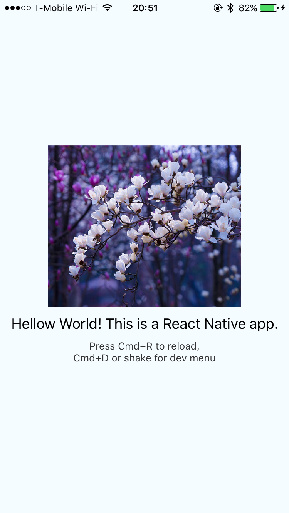

# EC601-HW2-Repo

We have created portfolio websites for both of us, Chris Kang and Saurabh Singh as a part of this homework.
The websites can be found at:
Chris Kang: http://www.alishapark.com
Saurabh Singh: http://www.saurabh.tech

Both websites are hosted on the AWS Free tier using Node.js to serve the html pages and the resume files to visitors.

We also forayed into iOS development using React framework and created a simple application.

